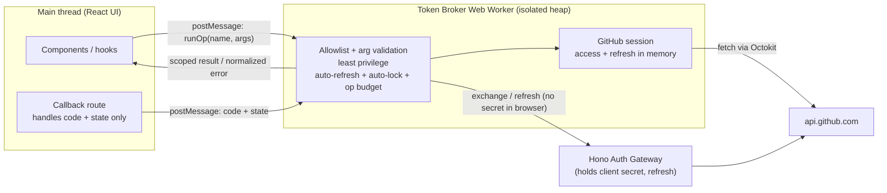
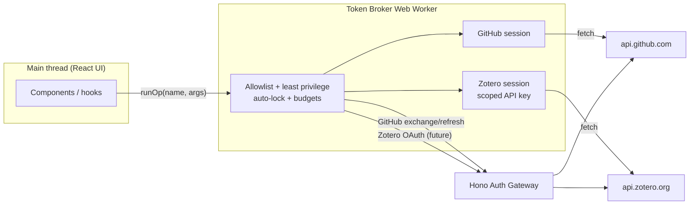

# MOREL V3 — Client Token Broker & SPA Security Hardening

## 1. Purpose and Scope

This document defines how MOREL Studio protects the user accounts it connects to (GitHub now, Zotero later) without introducing a server-held session or a persistent secret vault.

It specifies a defense-in-depth design built around a **Web Worker token broker**, combined with a strict Content Security Policy, GitHub token expiration/refresh, session containment, and gateway hardening.

The scope is the browser-only SPA (`apps/web`) and its relationship to the stateless Hono Auth Gateway (`workers/auth`). It complements — and does not replace — `01-worker-auth-gateway-architecture.md` and `02-github-auth-system-spec.md`.

All layers in this document are intended for **immediate implementation**, with two exceptions that are documented as forward-looking addenda:

- **Zotero** integration (gateway + OAuth + scoped keys) is deferred. All Zotero-specific design lives in **Addendum A**.
- **Cross-origin iframe relocation** of the broker is deferred to the pre-production / later-MVP hardening phase. It lives in **Addendum B**.

______________________________________________________________________

## 2. Threat Model and Security Goals

### 2.1 The honest ceiling

GitHub and Zotero authenticate API calls with **bearer tokens**. A bearer token is usable by anyone who holds it, and the SPA must be able to use it from the same origin that renders untrusted-by-default UI code. Therefore:

- We **can** prevent raw-token *exfiltration* (stealing the token bytes).
- We **can** enforce *least privilege* on every operation.
- We **can** make any compromise *short-lived* and *noisy*.
- We **cannot** fully prevent a same-origin XSS or a malicious dependency from *driving* the broker's allowed operations while a session is live ("confused deputy").

The design goal follows directly: **make the token unreachable, make the capabilities minimal, make compromise short-lived and detectable.**

### 2.2 Primary threats

| Threat | Mitigated by |
| -- | -- |
| Token read from main-thread JS heap / DevTools | Token broker (§4) |
| Token exfiltration to attacker domain | CSP `connect-src` allowlist (§6) |
| Script injection (DOM/stored/reflected XSS) | CSP + Trusted Types (§6) |
| Malicious/compromised dependency | Supply-chain hardening (§7) |
| Authorization `code` leaking from callback URL | URL hygiene (§8) |
| Long-lived stolen token | GitHub expiration + refresh (§5), auto-lock (§9) |
| Abuse of allowed operations by injected script | Least privilege + destructive-op gating + op budgets (§4, §9) |
| Gateway abuse / DoS | Gateway hardening + rate limiting (§11) |
| Malicious browser extension (host permissions) | Partially — §12 (WebAuthn step-up, least privilege, short-lived tokens) |
| Fully compromised end-user device | Partially — §12 (off-device replay prevention, blast-radius limits, containment) |

### 2.3 Partially Mitigated Threats (Not Fully Solvable Client-Side)

These two threats cannot be *prevented* from inside a browser app, but they can be meaningfully *contained*. They are documented as partially mitigated, with controls in §12 — not as ignored.

- **Fully compromised end-user device.** Malware with the user's privileges can read browser process memory (including the worker/iframe heap and the live token), keylog a passphrase, read disk, or MITM TLS via a rogue root CA. No in-page mechanism survives this; §12 limits off-device replay, blast radius, and persistence.
- **Malicious browser extension with host permissions.** Such an extension is not subject to the page CSP, can inject into the page's main world to hook `fetch` / `postMessage` / `Worker`, and can observe the outbound `Authorization` header via `webRequest`. A broad (`<all_urls>`) extension also holds permission for the vault origin, so Addendum B does not stop it; §12 gates the most damaging operations out-of-band and shrinks blast radius.

### 2.4 Non-goals

- Server-side storage of user tokens (explicitly out of scope per `01-...architecture.md` §6.2).
- *Complete* prevention of the two threats in §2.3 — the objective there is containment and crown-jewel protection, not impossibility.

______________________________________________________________________

## 3. Architecture Overview

The token never lives in the React tree. A dedicated Web Worker (the **broker**) owns the entire token lifecycle and exposes only a narrow, named-operation capability API over `postMessage`. The main thread asks for *operations*, never for *tokens*.



Key property: the GitHub access token's bytes are **never present in the main-thread JS heap**. The worker's global scope is a separate heap reachable only via `postMessage`, so heap snapshots, DevTools, and closure-walking on the main thread cannot recover it.

______________________________________________________________________

## 4. Token Broker Web Worker

### 4.1 The broker owns acquisition, not just storage

The token must never transit the main-thread heap. The broker therefore owns the entire acquisition tail:

- **OAuth / GitHub App flow:** the callback route receives only `code` + `state`, validates `state`, and posts the **`code`** to the broker. The broker calls the gateway `POST /github/oauth/exchange`, receives the token, and stores it. The main thread never sees an access token.
- **Device flow:** the broker performs the polling against the gateway, not the UI.
- **PAT (advanced option):** the pasted token arrives via a DOM input on the main thread; it is posted to the broker immediately and the input is cleared. This is the only path where a token momentarily touches the main thread, and only because the user typed it.

### 4.2 Capability API — never `getToken()`

The broker exposes a **named-operation allowlist**, not a generic request passthrough. A passthrough would re-expose full account power to any caller and defeat the purpose.

```ts
// The main thread only ever constructs values of this shape.
// It never receives a token or an Octokit instance.
type BrokerRequest =
  | { op: "github.getUser" }
  | { op: "github.listRepos" }
  | { op: "github.writeProjectFile"; repo: string; path: string; content: string }
  | { op: "github.dispatchWorkflow"; repo: string; workflow: string }
  | { op: "github.readWorkflowRun"; repo: string; runId: number }
  | { op: "github.disconnect" };

type BrokerResponse =
  | { ok: true; data: unknown }
  | { ok: false; error: BrokerErrorCode };
```

Rules:

- The broker holds the only `Octokit` instance, constructed with the in-memory token.
- The broker never returns the token, the Octokit instance, or refresh material.
- The main thread interacts only through `runOp(request)` → `BrokerResponse`.
- The public `useGitHubAuth()` hook returns session **status** (`status`, `user`, `scopes`, `method`, `appInstalled`) and **capability methods**, **never** `token`. (This is a change from the current hook, which returns `token`.)

### 4.3 Least-privilege enforcement inside the broker

Even a legitimate-looking op from injected script must be constrained:

- **Validate every argument** with Zod; reject unknown ops and unknown fields.
- **Constrain targets**: `writeProjectFile` / `dispatchWorkflow` only operate on repositories that match a MOREL-owned ownership/naming rule. Injected script cannot pivot to arbitrary repositories.
- **Return only required fields**, not full upstream payloads, to avoid leaking unrelated repo/account metadata.
- **Destructive operations are not in the standing allowlist** (see §9.2).

______________________________________________________________________

## 5. GitHub Token Lifecycle (Expiration and Refresh)

Enable **GitHub App user-to-server token expiration** (≈8h access token + ≈6-month refresh token). This bounds the value of any stolen token.

The broker absorbs the entire lifecycle so the UI never observes it:

1. Broker stores `accessToken`, `refreshToken`, and `accessExpiresAt` **in worker memory only**.
2. Before each op (or on a `401`), if the access token is expired/near-expiry, the broker calls a new gateway route **`POST /github/oauth/refresh`** and retries the op once.
3. Refresh **requires the client secret**, so it must happen in the gateway — never the browser.

```plaintext
New gateway route (workers/auth):
  POST /github/oauth/refresh
    body:    { refreshToken: string }
    returns: { accessToken, refreshToken, expiresIn, refreshTokenExpiresIn, scope }
```

Reload behavior: worker memory is cleared on reload, so the session ends and the user re-authenticates. This is the intended **no-vault** default — nothing secret is persisted. Persisting the **refresh token** (and only the refresh token) across reloads is the *single* legitimate reason to reintroduce the encrypted vault later; it is explicitly out of scope here.

______________________________________________________________________

## 6. Content Security Policy and Trusted Types

The broker limits blast radius; CSP limits whether injected script runs at all and whether it can phone home. This is the higher-leverage half of the design.

GitHub Pages cannot set response headers, so the policy is delivered via a `<meta>` tag in `apps/web/index.html`, and the Vite build must emit **no inline scripts**.

```html
<meta http-equiv="Content-Security-Policy" content="
  default-src 'none';
  script-src 'self';
  worker-src 'self';
  connect-src 'self' https://api.github.com https://github.com https://morel-auth.delpinoivivas.workers.dev;
  style-src 'self';
  img-src 'self' https://avatars.githubusercontent.com data:;
  font-src 'self';
  base-uri 'none';
  object-src 'none';
  frame-ancestors 'none';
  form-action 'none';
  require-trusted-types-for 'script';
">
```

Notes:

- **`connect-src` allowlist is the exfiltration backstop.** Even if script is injected, it cannot `fetch()` data to an attacker-controlled domain; it can only reach GitHub and the gateway. Per-environment values must include the correct gateway URL (dev/staging/production) and, later, the Zotero endpoints (Addendum A).
- **`require-trusted-types-for 'script'`** kills DOM-XSS sink injection. React is largely compatible; audit any `dangerouslySetInnerHTML` and DOM library usage.
- **`frame-ancestors 'none'`** prevents clickjacking; **`base-uri 'none'`** blocks `<base>`-tag hijacking; **`object-src 'none'`** blocks plugin vectors.
- Add **`Referrer-Policy: no-referrer`** via `<meta name="referrer" content="no-referrer">`.

______________________________________________________________________

## 7. Supply-Chain Hardening

A malicious dependency runs at full trust and defeats the broker (it can intercept the token at use time). Dependency hygiene is therefore a first-class control, not an afterthought.

- Keep dependencies minimal; prefer the platform (`fetch`, `crypto.subtle`) over libraries.
- Commit and enforce a **pinned lockfile**; no floating ranges for security-sensitive packages.
- Run **`pnpm audit`** (or equivalent) in CI and gate merges on it.
- Enable automated dependency updates (e.g. Dependabot) with review.
- Apply **Subresource Integrity (SRI)** to any externally hosted asset; ideally self-host all assets so `script-src 'self'` is sufficient.
- Load **no third-party scripts** on the auth, callback, or any token-handling pages.

______________________________________________________________________

## 8. Callback and URL Hygiene

The OAuth `code` arrives in the callback URL query string and must not linger.

- Immediately call `window.history.replaceState(...)` to strip `code`/`state` **before any `await`** in the callback handler.
- Navigate home with `replace: true` so the callback URL does not remain in history.
- `Referrer-Policy: no-referrer` (§6) prevents the `code` leaking via the `Referer` header.
- Never render raw callback query values into the DOM.
- The callback hands the `code` to the broker (§4.1); it does not store a token in `sessionStorage`. This removes the current fixed-key `sessionStorage` handoff window entirely.

______________________________________________________________________

## 9. Session Containment

The residual risk is injected script driving allowed operations during a live session. The following shrink and surface that window.

### 9.1 Auto-lock

- The broker wipes all token material from memory after **N minutes idle** and on `pagehide` / `visibilitychange → hidden`.
- Resuming requires a silent refresh (§5) or re-authentication.

### 9.2 Destructive-operation gating

- Destructive operations (e.g. repository deletion used by the write-test cleanup) are **not** in the standing capability allowlist.
- They require a **fresh, explicit user gesture** that the broker can distinguish from a programmatic call (a short-lived, single-use confirmation grant minted from a real click handler).
- The write-test cleanup uses a separate, narrowly scoped, short-lived grant rather than a standing destructive capability.

### 9.3 Operation budgets and anomaly caps

- The broker enforces a per-session rate/quantity budget on sensitive ops (writes, dispatches) to blunt automated abuse.
- Exceeding a budget locks the session and surfaces a warning.

### 9.4 Scope and permission minimization

- Trim the GitHub App's `Administration: Read and write` if it exists only for the write-test; prefer a flow that does not require standing repo-admin power.
- Request the **minimum** OAuth/device scopes the product actually uses.
- This caps damage regardless of broker logic and is the cheapest blast-radius reduction available.

### 9.5 Telemetry scrubbing

- Ensure no token, authorization `code`, or refresh material can serialize into Sentry breadcrumbs, error payloads, or logs (extends `01-...architecture.md` §14.3).

______________________________________________________________________

## 10. Revocation

"Disconnect" must revoke, not merely forget:

- **GitHub:** the broker calls the gateway to revoke the app authorization / installation token server-side, then wipes worker memory.
- The UI reflects a fully disconnected state only after the broker confirms memory is cleared.

______________________________________________________________________

## 11. Auth Gateway Hardening

These complement the existing protections in `01-...architecture.md` §11.

### 11.1 Request hygiene

- Reject requests whose `Content-Type` is not `application/json`.
- Enforce a small **max body size** (≈2–4 KB) on all routes.
- Strict Zod schemas; reject unknown fields.

### 11.2 Response hygiene

- Set `Cache-Control: no-store`, `Pragma: no-cache`, and `X-Content-Type-Options: nosniff` on all auth responses, especially those carrying tokens, device codes, or exchange results.

### 11.3 Normalized errors

- Never echo raw upstream GitHub error text to the browser (current behavior in `github-oauth.ts` and `github-device.ts`).
- Return stable error codes only; log sanitized upstream detail server-side with a request ID.

Client-safe error codes:

```plaintext
invalid_request | invalid_code | authorization_pending | slow_down |
expired_token | access_denied | upstream_unavailable | rate_limited |
misconfigured_gateway
```

### 11.4 Lock down client ID and scopes

- Remove caller-supplied `clientId` from the device endpoints; always use the gateway env `GITHUB_CLIENT_ID`.
- Reject browser-supplied arbitrary scopes; enforce a server-side scope allowlist. This prevents the gateway from becoming a generic GitHub OAuth/device broker.

### 11.5 Rate limiting

- `POST /github/oauth/exchange` — strict (authorization codes are single-use).
- `POST /github/oauth/refresh` — strict per refresh token / IP.
- `POST /github/device/code` — moderate (starts flows).
- `POST /github/device/token` — allow expected polling, cap abuse per IP / device code.
- Implement via Cloudflare native rate-limiting/WAF rules or a Durable Object token bucket.

______________________________________________________________________

## 12. Defense Against Compromised Devices and Malicious Extensions

The two threats in §2.3 cannot be *prevented* from inside a browser app: an extension with host permissions operates at or above page privilege and bypasses the page CSP, and device malware operates below the browser entirely. The objective therefore shifts from *prevent compromise* to four achievable goals: **prevent off-device replay, shrink blast radius, gate the most damaging operations out-of-band, and detect/contain fast.** The following controls deliver those goals.

### 12.1 WebAuthn step-up for destructive and sensitive operations (primary control)

This is the one control that meaningfully protects the crown jewels even against both threats, because it is rooted in an authenticator that injected script, an extension, or device malware cannot forge or silently approve.

Flow:

1. At connect time, register a passkey (platform authenticator). Its **public** key is stored server-side (see tradeoff below).
2. Before any destructive/sensitive operation (e.g. repo delete, bulk write, disconnect-with-revoke), the gateway issues a random challenge.
3. The browser performs `navigator.credentials.get()` with `userVerification: "required"`. The user physically approves (biometric/PIN).
4. The gateway verifies the signed assertion against the registered public key and returns a single-use, short-TTL **operation grant**.
5. The broker refuses the destructive op unless it is accompanied by a valid grant.

Why it holds: an extension can *trigger* a ceremony, but it cannot fabricate a valid signed assertion without the hardware authenticator, nor fake the user's presence. The signature must therefore be verified **server-side** against the stored public key — client-side verification gives no protection, because main-world injection could swap both the assertion and the public key it is checked against.

Architectural tradeoff: server-side verification requires the gateway to **store WebAuthn credential public keys** (e.g. in Cloudflare KV or D1). This is a deliberate, minimal deviation from the otherwise-stateless gateway (`01-...architecture.md` §6.2): it stores per-user *public* keys and short-lived challenges only — never tokens or secrets.

In practice this is expected to ship only for a future **premium tier** — users with online accounts/sessions persisted on the Cloudflare backend (Worker + in-memory database) for a fee. Free/MVP users remain on the fully stateless, no-stored-account model and do not get WebAuthn step-up. This tradeoff and the premium account model must be approved before implementation. See `01-worker-auth-gateway-architecture.md` §6.3.

### 12.2 Hardware-backed keys / passkeys (prevents key theft)

- Prefer platform passkeys / WebAuthn credentials whose private keys live in the Secure Enclave / TPM and are non-extractable.
- This prevents an attacker from *exfiltrating* the authentication credential for replay on another device. Malware can still *use* the credential while the device is unlocked, but persistence and lateral movement are eliminated.
- Any local crypto (if a vault is later added) should likewise use non-extractable `CryptoKey` objects so raw key bytes never exist in JS.

### 12.3 Short-lived access tokens (cross-ref §5)

- GitHub access-token expiration plus gateway-mediated refresh (§5) means a token captured from the `Authorization` header or scraped from memory is valuable only for minutes.
- This is the cheapest blunt against both header-sniffing extensions and memory-scraping malware.

### 12.4 Least privilege at the source (cross-ref §9.4)

- Minimal GitHub App permissions, minimal requested scopes, and (later) a minimally scoped Zotero key cap what any captured token can do, regardless of the attacker's vantage point.

### 12.5 Server-side anomaly detection and rapid revocation

- Honest limit: normal GitHub/Zotero API calls go **directly from the browser**, not through the gateway, so the gateway can only observe auth-endpoint traffic (exchange/refresh/device). Client-only anomaly detection is therefore partial.
- What is actionable: rate/anomaly rules on the gateway auth endpoints (e.g. abnormal refresh frequency); a security panel that links to GitHub's authorized-apps page and the Zotero key page; and one-click revocation (§10) that invalidates tokens server-side.
- Lean on the providers' own account-security surfaces for detection of misuse of the bearer token itself.

### 12.6 Sender-constrained tokens — DPoP / mTLS (future, upstream-dependent)

- The proper long-term answer to header capture is binding the token to a non-extractable key (DPoP or mTLS) so a stolen bearer token cannot be replayed off-device.
- **GitHub and Zotero do not support this today**, so it is not actionable. Record it as aspirational: if either provider adds DPoP-style binding, adopt it.

> **Sidenote — runtime tamper self-checks.** It is possible to capture references to native functions early and detect whether `fetch` / `postMessage` have been monkey-patched, flagging a hostile environment. This is **weak and detection-only**: a sophisticated extension defeats it trivially. Treat it as an optional tripwire for telemetry/warnings, never as a security control. Not planned for implementation.

### 12.7 Managed / enterprise posture (deployment-dependent)

- Outside the application's control: locked-down browsers, extension allowlisting, and MDM materially reduce both threats. Relevant only if MOREL targets managed organizations; documented for completeness.

______________________________________________________________________

## 13. Residual Risks (Accepted for MVP)

- **Confused-deputy via the broker API:** same-origin XSS can still invoke allowed, least-privilege operations during a live session. Mitigated (not eliminated) by least privilege, destructive-op gating, op budgets, and auto-lock. Fully addressed only by Addendum B.
- **Malicious dependency:** runs at full trust; addressed by §7, not by the broker.
- **No cross-reload persistence:** sessions end on reload by design (no vault). Accepted.
- **Compromised device / malicious extension:** cannot be fully prevented; partially mitigated per §12 (off-device replay prevention, blast-radius limits, crown-jewel gating, containment).

______________________________________________________________________

## 14. Implementation Priority

Implement now, in this order:

1. **CSP + Trusted Types + `connect-src` allowlist** (§6) and URL hygiene (§8) — largest risk reduction, smallest effort.
2. **Token broker Web Worker** owning the token tail + capability API (§4); remove `token` from `useGitHubAuth()`.
3. **GitHub token expiration + gateway `/refresh` route** (§5); scope/permission minimization (§9.4).
4. **Session containment** (§9), **revocation** (§10), **gateway hardening** (§11), **supply-chain hardening** (§7).
5. **WebAuthn step-up gating for destructive operations** (§12.1, requires the credential-store tradeoff to be approved); **hardware-backed keys/passkeys** (§12.2); **server-side anomaly detection + rapid revocation** (§12.5).

Deferred / documented only:

- **Sender-constrained tokens / DPoP** (§12.6) — upstream-dependent.
- **Managed-environment posture** (§12.7) — deployment-dependent.
- **Addendum A — Zotero** (future integration).
- **Addendum B — Cross-origin iframe relocation** (pre-production / later MVP).

______________________________________________________________________

## Addendum A — Zotero Integration (Future)

Zotero is **not** implemented in this phase. This addendum captures the design so it can be added without reworking the broker.

### A.1 How Zotero auth differs from GitHub

- Zotero API access uses a **long-lived API key** (bearer-style), created by the user at `https://www.zotero.org/settings/keys`. There is **no expiration and no refresh concept**.
- Zotero also supports **OAuth 1.0a**, where Zotero mints an API key for the app. OAuth 1.0a request signing requires the **consumer secret**, which cannot live in the browser — so it must be mediated by a Zotero gateway route, mirroring the GitHub client-secret pattern.

### A.2 Two acquisition options

- **Manual scoped API key (preferred for first release):** the user creates a key scoped to the minimum needed (read-only, or a single library, write only if required) and pastes it. Fully client-only; **no gateway route required**. The key is posted to the broker immediately and the input is cleared.
- **OAuth 1.0a (later):** add Zotero routes to the Hono gateway (e.g. `POST /zotero/oauth/initiate`, `POST /zotero/oauth/exchange`) that hold the consumer secret and complete the signed handshake. This becomes the "future Zotero authorization mediation" referenced in `01-...architecture.md` §6.1.

### A.3 Broker extensions for Zotero

The broker pattern extends naturally — a second in-memory session and additional allowlisted ops:

```ts
type ZoteroBrokerRequest =
  | { op: "zotero.getKeyInfo" }
  | { op: "zotero.listItems"; libraryId: string }
  | { op: "zotero.createItem"; libraryId: string; item: unknown }
  | { op: "zotero.disconnect" };
```

- The Zotero key lives in worker memory only; the broker never returns it.
- Ops are constrained to the connected library.
- Return only required fields.

### A.4 Zotero-specific securing options

Because the key cannot expire, the lifetime-based mitigations are replaced by:

- **Minimal key scope at creation** (least privilege at the source — the strongest available control for Zotero).
- **Auto-lock** (§9.1) applies identically — wipe the key from memory on idle/hidden.
- **Easy revoke:** Zotero keys cannot be revoked via API, so the UI must link directly to the user's Zotero key-management page on disconnect, and the broker wipes memory.
- **CSP `connect-src`** must add `https://api.zotero.org` (and the Zotero OAuth host if OAuth is used).
- **Op budgets** (§9.3) apply to Zotero writes.

### A.5 Diagram (future, Zotero included)



______________________________________________________________________

## Addendum B — Cross-Origin Iframe Relocation (Pre-Production)

Deferred to the pre-production / later-MVP hardening phase. Documented here so the broker API is built to relocate cleanly.

### B.1 Motivation

A dedicated Web Worker is **same-origin**: its heap is isolated, but injected script in the studio origin can still `postMessage` it. Relocating the broker into a **cross-origin iframe** moves the token into a *different origin's* heap that studio-origin XSS cannot script.

### B.2 Design

- Host the broker logic in a tiny, dependency-minimal app at a separate origin (e.g. `vault.morel.<domain>`).
- The studio SPA embeds it as an iframe and communicates via `postMessage` using the **same capability API** defined in §4.2.
- The vault origin ships an ultra-strict CSP and owns the Web Worker; the token never enters the studio origin's heap.

### B.3 What it does and does not solve

- **Solves:** raw-token theft via studio-origin XSS becomes effectively impossible.
- **Does not solve:** the confused-deputy risk — studio XSS can still invoke the narrow capability API. Least privilege, destructive-op gating, and op budgets remain necessary.

### B.4 Migration note

Because the message protocol is identical to the in-origin Web Worker broker, relocation is primarily a deployment/origin change plus `postMessage` target hardening (strict `targetOrigin`, origin checks on both ends), not an API redesign. Building the broker API cleanly now (§4.2) is what makes this cheap later.

### B.5 Beyond browser-only (reference)

If maximum raw-token protection is ever required, a backend-for-frontend (server-held token + `HttpOnly` cookie) is stronger still, but it contradicts the current stateless-gateway decision (`01-...architecture.md` §6.2) and is recorded here only for completeness.

______________________________________________________________________

## Glossary

- **Bearer token:** a credential that grants access to whoever presents it, with no additional proof of identity. GitHub and Zotero both use bearer tokens, which is why a stolen token is directly usable.
- **Token broker:** the dedicated Web Worker that exclusively holds tokens and performs API calls on the UI's behalf, exposing only named operations.
- **Capability API:** an interface that grants the ability to perform specific, named operations (e.g. `writeProjectFile`) rather than handing out the underlying token. Callers get capabilities, not secrets.
- **Confused deputy:** an attack where malicious code abuses a legitimate, privileged component (here, the broker) to act on its behalf — without ever seeing the secret the component holds.
- **Least privilege:** granting only the minimum access required. Applied at the GitHub App permission level, the requested scopes, and per-operation target constraints in the broker.
- **CSP (Content Security Policy):** a browser-enforced policy that restricts what a page may load and where it may connect, delivered here via a `<meta>` tag because GitHub Pages cannot set headers.
- **`connect-src`:** the CSP directive listing the only network destinations the page may reach; acts as the exfiltration backstop.
- **Trusted Types:** a browser feature that blocks dangerous string-to-DOM injection sinks, mitigating DOM-based XSS.
- **XSS (Cross-Site Scripting):** injection of attacker-controlled script into the page, which then runs with the page's full origin privileges.
- **PKCE (Proof Key for Code Exchange):** an OAuth extension binding an authorization `code` to the client that initiated the flow, preventing intercepted-code reuse. Supported for the OAuth flow; not supported on the GitHub App installation endpoint.
- **CSRF state:** a random, single-use value sent through a redirect flow and validated on return to ensure the response corresponds to a request this client initiated.
- **Device Authorization Flow:** an OAuth flow where the user authorizes a code at `github.com/login/device` while the client polls for the resulting token; no redirect required.
- **Access token / refresh token:** the short-lived credential used for API calls, and the longer-lived credential used to mint new access tokens. Refreshing requires the client secret and therefore happens in the gateway.
- **Auth Gateway:** the stateless Hono Cloudflare Worker (`workers/auth`) that holds the GitHub client secret and mediates token acquisition/refresh; it never stores tokens.
- **Auto-lock:** wiping in-memory token material after inactivity or when the page is hidden, to shrink the exposure window.
- **Backend-for-frontend (BFF):** an architecture where a server holds the token and the browser receives only a session cookie; the strongest raw-token protection but not client-only.
- **OPFS:** the Origin Private File System, a sandboxed browser storage area; referenced as a potential encrypted-blob location only if a vault is later introduced.
- **WebAuthn:** a browser standard for public-key authentication using hardware authenticators; the private key is non-extractable and each use can require user verification.
- **Passkey:** a WebAuthn credential, typically backed by a platform authenticator (Secure Enclave / TPM), optionally synced across the user's devices.
- **Step-up authentication:** requiring an additional, stronger authentication (here a WebAuthn user-verification ceremony) immediately before a sensitive operation, rather than only at sign-in.
- **User verification:** the authenticator confirming the user's presence and identity via biometric or PIN during a WebAuthn ceremony; cannot be forged by software.
- **Operation grant:** a single-use, short-TTL token issued by the gateway after it verifies a WebAuthn assertion, required by the broker before performing a gated destructive operation.
- **Sender-constrained token (DPoP / mTLS):** a token cryptographically bound to a key held by the legitimate client, so a stolen bearer token cannot be replayed by another party. Not supported by GitHub or Zotero today.
- **Confused deputy:** see above — relevant here because step-up gating (§12.1) is the control that limits confused-deputy abuse of destructive operations.
